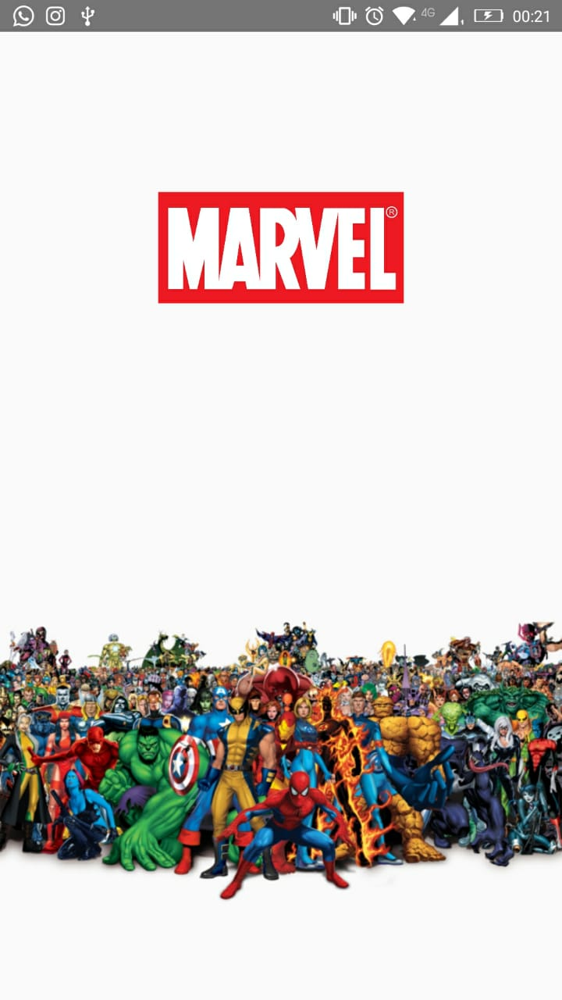
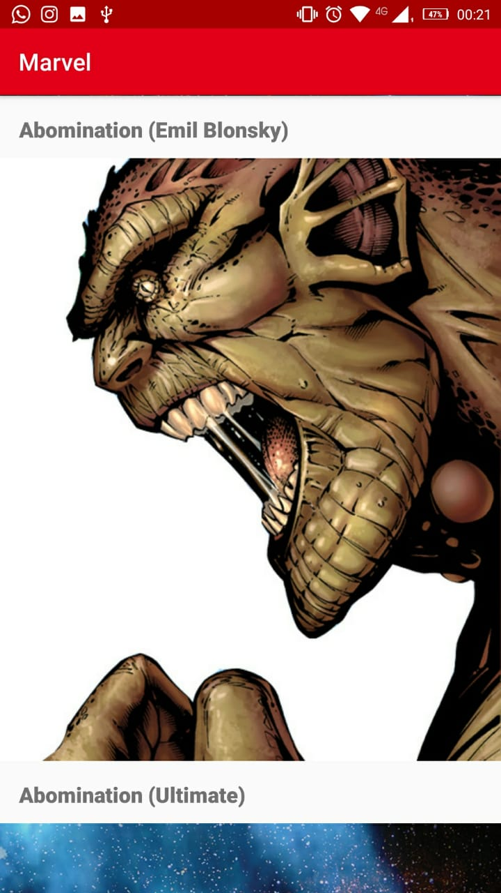
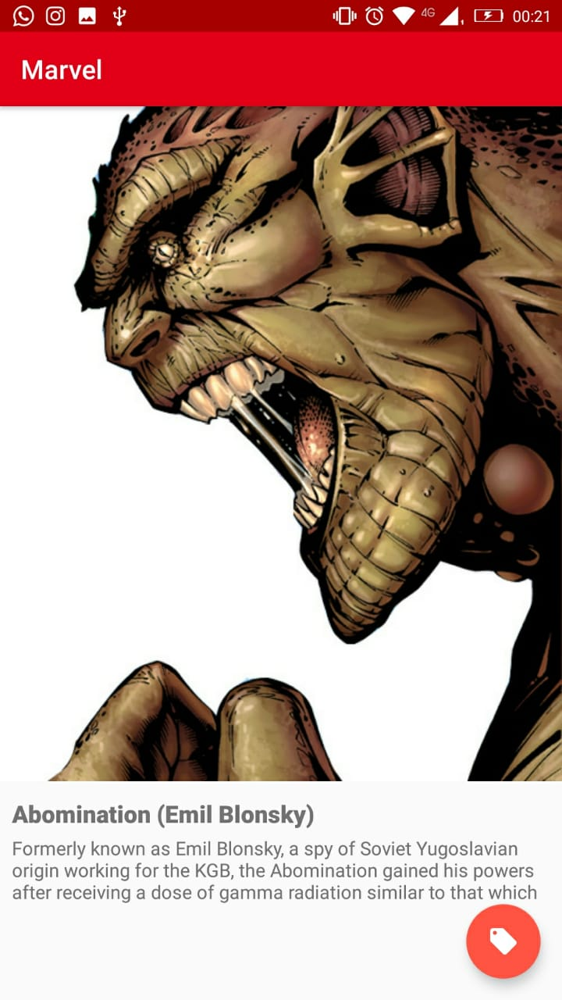
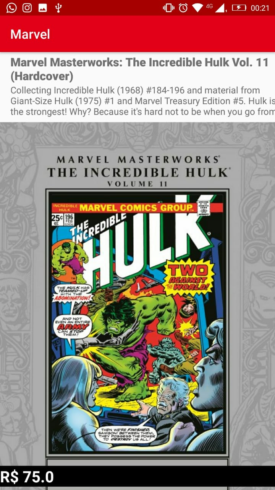

# desafio-android-diego-souza

App Feed Marvel

## Sobre o app

O app é um feed de personagens da marvel, com possibilidade de ver detalhes e revistas

## Api Rest
Para se comunicar com a API e obter um retorno GET
utilizei o Retrofit2

## Carregamento de Imagem
utilizei o Glide

## Listagem
utilizei o RecyclerView

## Padrao arquitetura
utilizei MVC

## img

